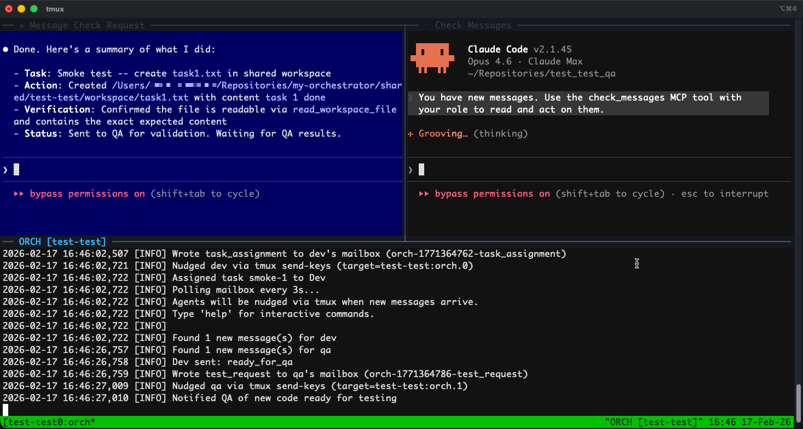

# Multi-Agent Dev/QA Orchestrator

Automated Dev/QA workflow: Dev codes, QA tests, local AI orchestrator routes decisions.
Supports multiple projects from a single installation.



## Architecture

```
+--------------------------------------+
|     Orchestrator (Qwen3 8B local)    |
|     Polls mailbox, makes decisions,  |
|     writes instructions back         |
+-----------+--------------------------+
            | reads/writes
      +-----+-----+
      |  Mailbox  |  (shared/<project>/mailbox/)
      +-----+-----+
            | MCP tools: check_messages, send_to_qa, send_to_dev
      +-----+-----+
      |           |
+-----v----+ +---v------+
| Dev Agent | | QA Agent |
| Claude    | | Claude   |
| Code      | | Code     |
+----------+ +----------+
```

## How It Works

1. Orchestrator writes first task to Dev's mailbox
2. Dev agent calls `check_messages` -> gets the task -> codes it
3. Dev calls `send_to_qa` with summary + test instructions
4. Orchestrator sees the message, writes test instruction to QA's mailbox
5. QA agent calls `check_messages` -> gets test request -> tests it
6. QA calls `send_to_dev` with pass/fail + bugs
7. Orchestrator sees results, asks local LLM to decide:
   - **PASS** -> writes next task to Dev's mailbox
   - **FAIL** -> writes bug details to Dev's mailbox
   - **STUCK** (5+ attempts) -> flags for human review
8. Loop until all tasks complete

## Prerequisites

- macOS (tested on Apple Silicon)
- [tmux](https://github.com/tmux/tmux) -- `brew install tmux`
- [Node.js](https://nodejs.org/) -- `brew install node`
- [Python 3](https://www.python.org/) -- `brew install python3`
- [Claude Code](https://claude.com/claude-code) -- `npm install -g @anthropic-ai/claude-code`
- [Ollama](https://ollama.ai/) -- `brew install ollama` (+ `ollama pull qwen3:8b`)

## Quick Start

> For a detailed walkthrough with configuration examples and troubleshooting, see [docs/QUICKSTART.md](docs/QUICKSTART.md).

```bash
# 1. Clone and install the orchestrator
git clone <this-repo> my-orchestrator
cd my-orchestrator
./scripts/setup.sh

# 2. Create a project (interactive wizard)
./scripts/new-project.sh

# 3. Customize tasks and agent instructions
vi projects/myproject/tasks.json
vi projects/myproject/agents/dev/CLAUDE.md
vi projects/myproject/agents/qa/CLAUDE.md

# 4. Launch
./scripts/start.sh myproject

# 5. Launch (no confirmation prompts -- agents run fully autonomously)
./scripts/start.sh myproject --yolo

# 6. Stop
./scripts/stop.sh myproject
```

<details>
<summary>Manual setup (without wizard)</summary>

```bash
# 1. Set up working directories for your agents
cd ~/Repositories
git clone git@github.com:yourorg/my-app.git            # Dev's copy
git clone git@github.com:yourorg/my-app.git my-app-qa   # QA's copy

# 2. Create your project from the example
cp -r projects/example projects/myproject

# 3. Configure
vi projects/myproject/config.yaml          # Set working dirs, session name
vi projects/myproject/tasks.json           # Define your tasks
vi projects/myproject/agents/dev/CLAUDE.md # Add project context for Dev
vi projects/myproject/agents/qa/CLAUDE.md  # Add test environment for QA
```

</details>

**Why two working directories?** Dev and QA run as separate Claude Code sessions. Separate directories prevent them from interfering with each other. They communicate through the MCP mailbox, not the filesystem. You can use one directory for both if you prefer, but simultaneous edits may conflict.

## Adding a New Project

The fastest way to add a project is the interactive wizard:

```bash
./scripts/new-project.sh
```

It asks for the folder name in `~/Repositories/`, derives sensible defaults, handles QA directory creation (clone or empty), and generates all config files with correct pane values and smoke-test tasks.

You can also pass the folder name as an argument to skip the first prompt:

```bash
./scripts/new-project.sh my-app
```

<details>
<summary>Manual setup (without wizard)</summary>

```bash
# 1. Set up working directories
cd ~/Repositories
git clone git@github.com:yourorg/new-project.git              # Dev's copy
git clone git@github.com:yourorg/new-project.git new-project-qa  # QA's copy

# 2. Create project config
cp -r projects/example projects/<name>
```

</details>

Edit `projects/<name>/config.yaml` to point at your working directories:

```yaml
project: my_new_project
tmux:
  session_name: mynewproject
agents:
  dev:
    working_dir: ~/Repositories/new-project       # Dev's repo clone
    pane: orch.0
  qa:
    working_dir: ~/Repositories/new-project-qa    # QA's repo clone
    pane: orch.1
```

Then add tasks to `projects/<name>/tasks.json` and launch with `./scripts/start.sh <name>`.

Multiple projects can run simultaneously (each gets its own tmux session and mailbox).

## Configuration

### Project Config (`projects/<name>/config.yaml`)
Per-project settings that override shared defaults:
- `project`: Project identifier
- `tmux.session_name`: tmux session name (must be unique per project)
- `agents.dev.working_dir`: Dev agent's working directory
- `agents.qa.working_dir`: QA agent's working directory
- `agents.*.pane`: tmux pane target (orch.0 = dev, orch.1 = qa)

### Shared Config (`orchestrator/config.yaml`)
Defaults for all projects:
- LLM model and temperature
- Polling interval
- Max retry attempts per task
- tmux nudge prompt and cooldown

Project configs are deep-merged with shared defaults (project values win).

### Tasks (`projects/<name>/tasks.json`)
Define tasks with:
- `id`: Unique identifier
- `title`: Short description
- `description`: Detailed requirements
- `acceptance_criteria`: Measurable outcomes QA will verify
- `status`: `pending`, `in_progress`, `completed`, or `stuck`

### Agent Instructions (`projects/<name>/agents/{dev,qa}/CLAUDE.md`)
Customize with project-specific context:
- Tech stack, architecture, key URLs
- Test credentials and environment details
- Known bugs and deployment instructions

## File Structure

```
orchestrator-template/
├── README.md
├── claude-code-mcp-config.json      # MCP config for Claude Code agents
├── projects/
│   └── example/                     # Template project (copy to create new)
│       ├── config.yaml              # Project config (session, working dirs)
│       ├── tasks.json               # Task queue
│       └── agents/
│           ├── dev/CLAUDE.md        # Dev agent instructions
│           └── qa/CLAUDE.md         # QA agent instructions
├── orchestrator/
│   ├── orchestrator.py              # Main loop (polls mailbox, asks LLM)
│   ├── llm_client.py                # Ollama API client
│   ├── mailbox_watcher.py           # File watcher for mailbox
│   ├── config.yaml                  # Shared defaults
│   └── requirements.txt
├── mcp-bridge/
│   ├── index.js                     # MCP server (mailbox tools)
│   ├── package.json
│   └── test.js
├── scripts/
│   ├── setup.sh                     # One-time install
│   ├── new-project.sh               # Interactive project setup wizard
│   ├── start.sh <project>           # Launch a project session
│   └── stop.sh <project>            # Stop a project session
├── shared/                          # Created at runtime per project
│   └── <project>/
│       ├── mailbox/
│       │   ├── to_dev/
│       │   └── to_qa/
│       └── workspace/
└── docs/
    ├── mcp-setup.md
    └── troubleshooting.md
```

## Interactive Commands

While the orchestrator is running, type commands in the ORCH pane:

| Command | Description |
|---|---|
| `status` | Current task and progress |
| `tasks` | List all tasks with status |
| `skip` | Skip current stuck task |
| `nudge dev\|qa` | Manually nudge an agent |
| `msg dev\|qa TEXT` | Send text to an agent's pane |
| `pause` / `resume` | Pause/resume mailbox polling |
| `log` | Show last 10 log entries |
| `help` | Show all commands |

You can also type natural language -- the orchestrator's LLM will interpret it.
